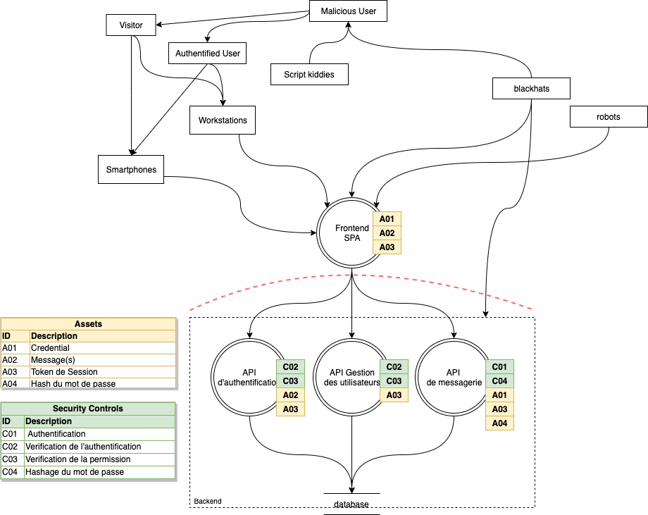
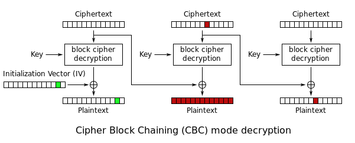

# STI - Projet 2

# Table des matières

- Introduction
- Analyse de Menace
- CSRF
- Bad crypto
- Echec
- Conclusion

# Introduction

- frontend SPA en vuejs
- backend API RESTful en expressjs 

::: notes
Le projet initiale a été développer avec un frontend en Single Page App en vuejs et une API RESTful en expressjs.

Nous allons vous présenter les attaques intéressantes que nous avons pu faire sur cette infrastructure.
:::

# Analyse de Menaces

## DFD



::: notes
Nous pouvons rapidement voir la frontière de confiance qui se trouve réellement au niveau du backend.

On voit bien que les attaques peuvent être faite directement sur le backend sans passer par le frontend.
:::

## Points critiques

- L'intégrité
- La confidentialité

::: notes
Si une faille permet de lire/modifier/envoyer des messages sans être autorisé à accéder à ce compte, cela est extremement critique et peut détruire le service.
:::

# CSRF

## Prérequis

- pas de cross-origin
- JSON valide

::: notes
Le frontend est fourni par le backend ce qui permet de ne pas avoir de CORS défini ce qui implique une certaine sécurité.

L'API ne travail uniquement en JSON ce qui impose donc de pouvoir envoyer du JSON par un formulaire HTML.
:::

## Tentatives d'attaques

```html
<form method="POST" action="http://localhost:3000/message" enctype="text/plain">
    <input type="text" name='{"to":1,"subject":"CRSF ", "message":"' value='pwned"}' />
    <input type="submit" />
</form>
```

::: notes
Il n'est pas possible d'envoyer du JSON de manière standard. mais il est possible d'abuser de certaine option.

Ce formulaire permet parfois de profiter de faille de type CSRF, dans notre cas cela n'a pas fonctionner.
:::

##

```html
<form method="POST" action="http://localhost:3000/message">
    <input type="number" name='to' value='1'/>
    <input type="text" name='subject' value="CRSF PWNED" />
    <input type="text" name='message' value='HAHAH' />
    <input type="submit" />
</form>
```

::: notes
Dans notre cas, l'application comportait le parser pour les types `application/x-www-form-urlencoded` mais le serveur ne traite uniquement les données en JSON.
Cela avait pour concequence de faire planter la requete ce qui aurait pu permettre d'expoiter le parser pour effectuer un CSRF.

L'application n'accepte que le JSON donc il n'est pas nécessaire de l'avoir. nous avons donc désactiver celui-ci pour éviter tout risque.
:::

# Bad crypto
## Sources des problémes

- IV réutilisé
- AES-CBC 
- IV malléable


## Schéma CBC


::: notes
Bien expliquer que CBC est très malléable si l'IV l'est. Comme démontré dans l'illustration le premier bloc peut être modifié.
L'IV réutilisé même sans pouvoir le modifier aurait été une faille car il y aurait eu Information Disclosure
:::

# Echec

- XSS - vuejs sanitize tout input
- Injection SQL - Sécurisé par Prepare Statements

::: notes

:::

# Conclusion

- Technologie moderne

::: notes

:::

# Question
