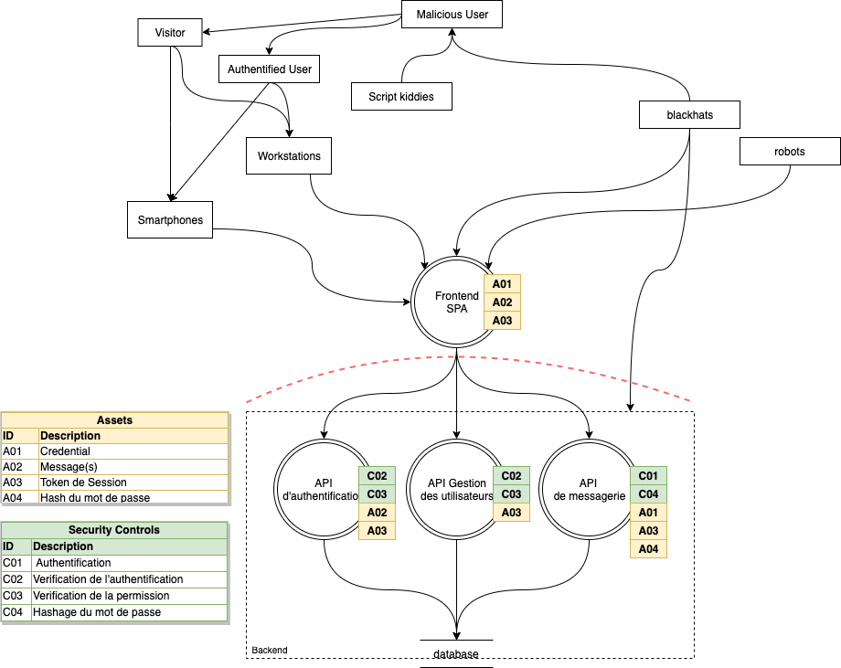

# Analyse de Menaces

## Description du système

L'application est une messagerie permettant d'échanger des messages entre les utilisateurs `authentifiés`.
Elle se compose d'un frontend de type SPA (Single Page Application) développé en VueJS.
Ce frontend communique avec une API backend proposant les différents services permettant le bon fonctionnement de l'application.
Développé en expressjs, il communique avec une base de données MariaDB stockant l'ensemble des données persistantes.

## Fonctionnalités

Les utilisateurs non authentifiés peuvent uniquement s'authentifier.
Les utilisateurs authentifiés peuvent échanger des messages avec les autres utilisateurs.
Il peut consulter ces messages et ceux qu'il a envoyés.

Les administrateurs de l'application ont la capacité de créer des nouveaux comptes, de les activer/désactiver et de les supprimer.

Les comptes peuvent potentiellement être payants à l'avenir.

## Hypothèses et exigences de sécurité

La partie backend est de confiance avec la base de données ainsi que ces administrateurs.

Les exigences de sécurités sont les suivantes :
- L'application ne doit être accessible qu'aux utilisateurs authentifiés.
- Les messages doivent être uniquement visibles par l'expéditeur et le destinataire.
- Un utilisateur n'ayant pas le rôle d'administrateur ne doit pas pouvoir accéder au panel d'administration.
- Un compte désactivé ne doit pas pouvoir s'authentifier ni pouvoir interagir avec l'application.

## Actifs à haute valeur

Base de données des messages :
- Confidentialité, sphère privée
- Intégrité (une modification pourrait avoir de grave conséquence)
- Incident nuirait gravement à la réputation de l'application

Base de données des utilisateurs :
- Confidentialité, sphère privée
- Incident nuirait à la réputation de l'application

## Source de menaces

Hackers, script kiddies
- Motivation : s'amuser
- Cible : découverte de bug, spam
- Potentialité : Moyenne

Cybercrime (spam, maliciels)
- Motivation : financière
- Cible : Phising, spam sur les clients authentifiés, lecture/modification des messages, accès au panel admin
- Potentialité : Élevée

Concurrent
- Motivation : Arrêt du service
- Cible : Bug dans le backend
- Potentialité : Moyenne

## DFD

## Scénario d'attaque

### Lecture de message
- Business impact : Élevé (perte de confidentialité)
- Provenance : Cybercrime
- Motivation : Récupération d'information, destruction de la réputation
- Actif : Base de données des messages
- Sénario d'attaque : Injection SQL, CSRF, Erreur de contrôle
- Contrôles : Contrôle d'origine (CORS), Prepared statement, validation d'entrée

### Modification de message
- Business impact : Élevé (perte d'intégrité)
- Provenance : Cybercrime
- Motivation : Modification d'information, destruction de la réputation
- Actif : Base de données des messages
- Sénario d'attaque : Injection SQL, CSRF, Erreur de contrôle
- Contrôles : Contrôle d'origine (CORS), Prepared statement, validation d'entrée

### Spamming
- Business impact : Moyen (perte de réputation)
- Provenance : Utilisateur authentifié
- Motivation : Financière
- Actif : Base de données utilisateur
- Sénario d'attaque : Accès à de faux comptes ou volés
- Contrôles : Détection de vol de compte

### Vol de session
- Business impact : Élevé (perte de confiance)
- Provenance : Script kidding, Cybercrime
- Motivation : Envoi de message illégitime, Elevation de privilège
- Actif : Base de données utilisateur, Base de données de messages
- Sénario d'attaque : XSS
- Contrôles : HTML Sanitize

## Mitigation des risques

- Utilisation de Prepare Statement
- Sanitize l'ensemble des données textes
- Vérification de l'origine des requêtes (CORS)
- Vérification des droits et de l'authentification
- Validation de toutes les entrées
- antiCRSF token

