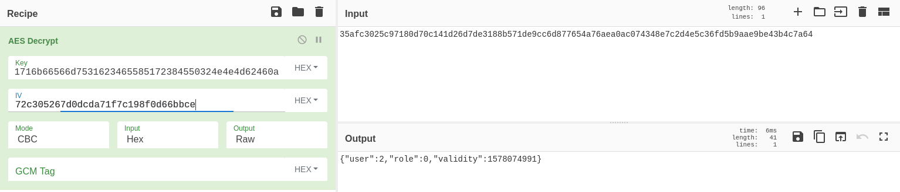
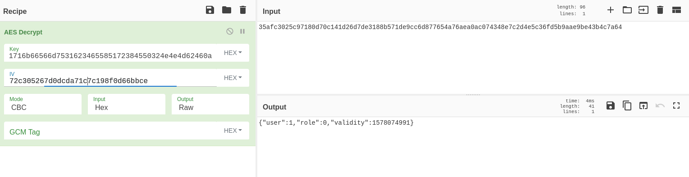
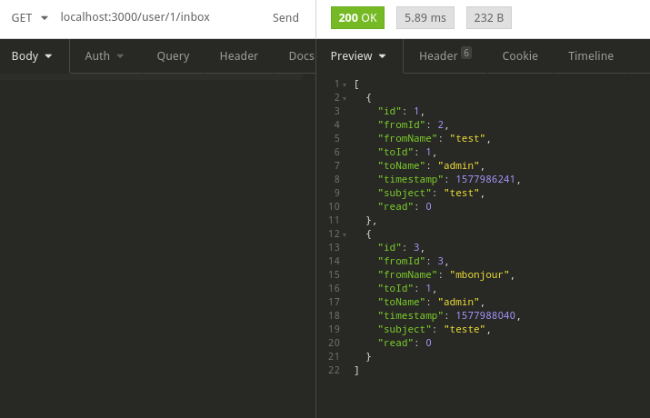

## Crypto

Analyse de la cryptographie utilisée dans l'application.
Lors de l'analyse du code, nous nous sommes concentrés sur la partie d'authentification assez rapidement. Ce que l'on a assez rapidement remarqué c'est l'utilisation de AES-CBC pour chiffrer les données ensuite utilisées lors des contrôles d'authentification.

Nous avons donc décidé d'examiner ce chiffrement et quels en était les possibles vulnérabilités.
De là on a pu remarqué que l'IV utilisé n'était jamais changé, c'est donc toujours le même utilisé (on aurait pu le remarquer sans regarder le code d'ailleurs, grâce au fait que l'IV est envoyé dans le token). Ceci induit une première vulnérabilité, en effet en réutilisant ce IV certains chiffrés seront identiques les uns des autres, ce qui permet de savoir à quelle fréquence un utilisateur se connecte si l'on voit les paquets envoyés.

De plus, comme je l'ai mentionné auparavant, l'IV est envoyé dans le token. Celui-ci est donc dans le cookie 'Authorization' et est donc modifiable.
Ceci est une très grosse vulnérabilité avec CBC, en effet l'IV est utilisé lors du déchiffrement du premier bloc comme montré ci-après.

Ainsi l'attaque se déroule comme suit :
Nous partons d'un utilisateur authentifié quelconque (ici test).
Son token Authorization se présente comme suit :

```
eyJpdiI6IjcyYzMwNTI2N2QwZGNkYTcxZjdjMTk4ZjBkNjZiYmNlIiwiZW5jcnlwdGVkRGF0YSI6IjM1YWZjMzAyNWM5NzE4MGQ3MGMx
NDFkMjZkN2RlMzE4OGI1NzFkZTljYzZkODc3NjU0YTc2YWVhMGFjMDc0MzQwYmNkZDVmYTI3NDM4MjlkYzYxMTBhMGM5MmRkYWRlMCIs
ImtleSI6IkFRam1CdW5GcXFrZlZtdTFiNGVYUXI4RVAyTk5NYkZcbiIsInVzZXJfaWQiOjIsImxldmVsIjowfQ
```

Qui décodé de la base64 donne :

```json
{
"iv":"72c305267d0dcda71f7c198f0d66bbce",
"encryptedData":
  "35afc3025c97180d70c141d26d7de3188b571de9cc6d877654a76aea0ac074340bcdd5fa2743829dc6110a0c92ddade0",
"key":"AQjmBunFqqkfVmu1b4eXQr8EP2NNMbF\n",
"user_id":2,
"level":0
}
```

L'on voit donc l'IV qui nous est donnée en hexadécimal dans le cookie, et qui est donc manipulable.
C'est un problème comme on peut le voir dans cette image ci-dessous :


Grâce à cela nous pouvons modifier le premier bloc de données à notre bon vouloir. Analysons donc ce qu'il peut bien avoir dans ce chiffre. 
Pour cette étape nous avons besoin du code, sinon nous ne pouvons a priori pas deviner le payload du chiffré. (Fichier login.js)

```js
let session = {};
    session.user = user.id;
    session.role = user.level;
    // 24 hour validity
    session.validity = Math.round(new Date().getTime() / 1000) + 24 * 60 * 60;

    let cookie = Crypto.encrypt(JSON.stringify(session));
```

Nous pouvons donc savoir que le plaintext sera sous cette forme :

```json
{"user":x,"role":x,"validity":x}
```

Et c'est vérifiable en utilisant la clé de déchiffrement (à des fins de démonstration, pas utile dans l'attaque) :



Sachant qu'AES fonctionne en bloc de 16bytes l'on peut déterminer le premier bloc de données comme suit :
{"user":x,"role"
Et là on voit finalement le problème, en effet l'on peut modifier l'ID de l'utilisateur dans le token.

En remplaçant le 9e byte de l'IV nous pourrons modifier l'id de l'utilisateur.
Ainsi 72c305267d0dcda71f7c198f0d66bbce va devenir 72c305267d0dcda71c7c198f0d66bbce(après quelques essais).
Et le déchiffrement deviendra (à but de démonstration, la clé n'est pas nécessaire pour l'attaque):



Et en recodant en base64 le payload modifié, nous pouvons faire des requêtes simulant l'utilisateur choisi (ici 1).
Comme l'on peut le voir en faisant cette requête :



## Mitigation

Pour cette attaque c'est une erreur d'implémentation la principale cause du problème.
Pour éviter ce genre d'attaque il faudrait passer à un autre mode de chiffrement, ce serait sûrement plus sûr, comme GCM p. ex. qui est un chiffrement authentifié et qui permettrait d'être sûr que l'IV n'est pas modifié.
Cependant il faudra modifier le code du fichier crypto.js afin que l'IV soit recréer à chaque chiffrement. 

```js
const iv = crypto.randomBytes(16);
```

Autrement dit, mettre cette ligne dans la fonction encrypt.
Nouvelle version avec GCM :

```js
/ TAKEN FROM https://codeforgeek.com/encrypt-and-decrypt-data-in-node-js/

// Nodejs encryption with CTR 

const crypto = require('crypto');
const algorithm = 'aes-256-gcm';

const fs = require('fs');

let key;

fs.readFile('./server.key', 'utf8', function (err, data) {
    if (err) throw err;
    key =data.toString();
});

function encrypt(text) {
 let iv = crypto.randomBytes(16);
 let cipher = crypto.createCipheriv('aes-256-gcm', Buffer.from(key), iv);
 let encrypted = cipher.update(text);
 encrypted = Buffer.concat([encrypted, cipher.final()]);
 return { iv: iv.toString('hex'), encryptedData: encrypted.toString('hex'),
    tag: cipher.getAuthTag().toString('hex') };
}

function decrypt(text) {
 let iv = Buffer.from(text.iv, 'hex');
 let encryptedText = Buffer.from(text.encryptedData, 'hex');
 let decipher = crypto.createDecipheriv('aes-256-gcm', Buffer.from(key), iv);
 decipher.setAuthTag(Buffer.from(text.tag, 'hex'))
 let decrypted = decipher.update(encryptedText);
 decrypted = Buffer.concat([decrypted, decipher.final()]);
 return decrypted.toString();
}

function sha256(text){
 return crypto.createHash('sha256').update(text, 'utf8').digest('hex')
}

function randomString(){
 return crypto.randomBytes(10).toString('hex');
}

exports.encrypt = encrypt;
exports.decrypt = decrypt;
exports.sha256 = sha256;
exports.randomString = randomString;

```

